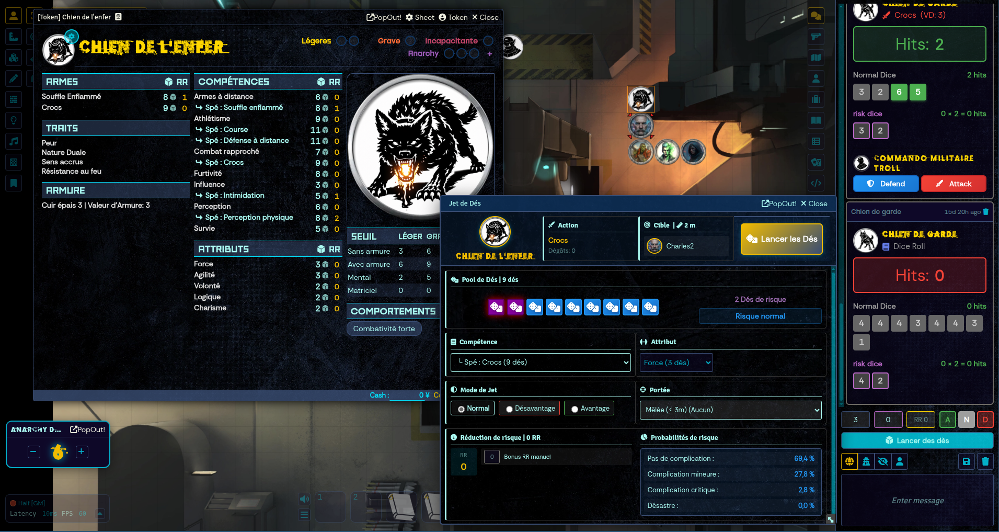
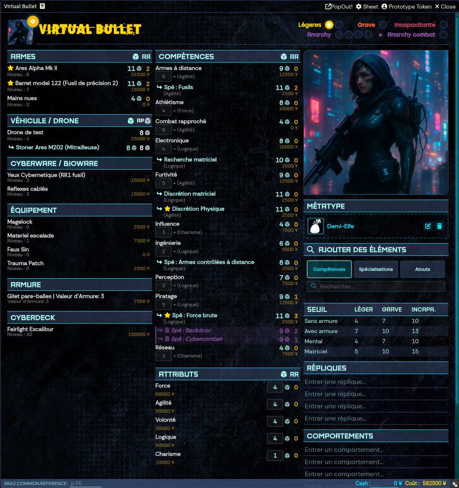
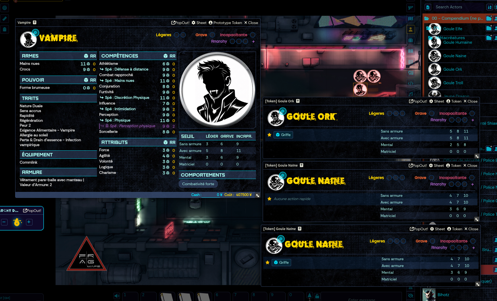

# Welcome to Shadowrun Anarchy 2 Unofficial System

If you are here, you probably know the world has changed, with technology melting with flesh, mythological creatures and magic raising back from the past.

This system implements Shadowrun Anarchy 2 rules for Foundry VTT.

To run a game, you will need the **Shadowrun Anarchy 2 rule book**.

- [Catalyst game labs](https://www.catalystgamelabs.com/) -  [Catalyst game labs products](https://store.catalystgamelabs.com/products/) 
- [Black Book Edition](https://www.black-book-editions.fr/) - [Black Book Edition products](https://black-book-editions.fr/catalogue.php?id=150)

## Compendiums

**Important Note:** This is an unofficial fan project and is not officially supported by Catalyst Game Labs or Black Book Editions.

The system is designed to allow you to create everything found in the Shadowrun Anarchy 2 rulebook and more. However, due to copyright restrictions, we cannot provide pre-made compendiums bundled with the system. Users must create their own content based on the official rulebooks they own.

No compendiums are provided to not infringe CGL or BBE copyrights. This may change depending on decision by BBE/CGL. If you have any contact with them, please let us know; we already have compendiums ready to launch.

# Screenshots

## Character Sheet and dice roll


## Advanced Mode


## Simplified NPC View



# System Features

This system provides all the tools needed to play Shadowrun Anarchy 2 in Foundry VTT.

## Actor Types

### Characters (PC/NPC)
- **One sheet for both NPCs and PCs**
- Complete view with all sections: Identity, Attributes, Resources, Combat, Skills, Feats, Weapons, Awakened, Traits
- NPCs can use threshold-based mechanics for quick resolution
- **Advanced Mode**: Toggle detailed view showing all metrics, calculations, and in-depth information for power users

### Group Anarchy
- **Shared Anarchy Points pool** for the entire group
- Automatic synchronization across all player characters
- Group-wide resource management

### Vehicles & Drones
- Full vehicle management with attributes (Autopilot, Structure, Armor, Handling, Speed)
- Support for all vehicle types: Microdrones, Minidrones, Small/Medium/Large Drones, Motorcycles, Cars, Trucks, Boats, Helicopters, VTOLs, T-Birds
- Mounted weapons and autopilot rolling
- Link vehicles to characters

### ICE (Intrusion Countermeasures Electronics)
- Matrix combat support with ICE types: Patrol, Acid, Blaster, Blocker, Black, Glue, Tracker, Killer
- Automated attack and effect application

## Item Types

### Skills
- 15+ base skills with linked attributes (Strength, Agility, Willpower, Logic, Charisma)
- Dice pool calculation (Attribute + Skill + Specialization)
- Drain and Convergence tracking for magical/matrix skills

### Specializations
- Link specializations to parent skills
- Automatic dice pool bonus (+1 die when applicable)

### Feats
All character abilities, equipment, and powers are managed as Feats:

| Type | Description |
|------|-------------|
| **Traits** | Character personality traits and backgrounds |
| **Contacts** | NPC relationships and connections |
| **Awakened** | Magical abilities (Astral Perception, Astral Projection, Sorcery, Conjuration, Adept powers) |
| **Adept Powers** | Physical adept abilities |
| **Equipment** | General gear and items |
| **Armor** | Protective equipment (stacking armor values 0-5) |
| **Cyberware/Bioware** | Cybernetic and biological enhancements (with Essence cost) |
| **Cyberdecks** | Matrix equipment with Firewall and Attack ratings |
| **Vehicles/Drones** | Transportation and remote units |
| **Weapons** | Combat equipment (40+ weapon types with DV, ranges, linked skills) |
| **Spells** | Magical abilities (spell categories: Combat, Detection, Health, Illusion, Manipulation) |
| **Powers** | Special abilities and powers |
| **Knowledge** | Knowledge-based abilities |

## Combat System

### Attack & Defense
- **Automated dice rolling** with hit calculation (5-6 = hit)
- **Roll modes**: Normal, Advantage (4-5-6), Disadvantage (6 only)
- **Risk dice**: 5-6 = 2 hits, 1 = critical failure
- **Risk Reduction (RR)**: Reduces critical failures (max 3)
- **Defense rolls**: Select defense skill and roll against attack hits
- **Counter-attacks**: Automatic counter-attack option when defense succeeds
- **Range management**: Automatic application of range bonuses/maluses based on weapon ranges (Melee, Short, Medium, Long) and target distance

### Damage System
Four damage gauges for each character:
- **Physical**: Light wounds (2 boxes), Severe wounds (1 box), Incapacitating
- **Mental/Magic**: Same structure for magical damage
- **Matrix**: Cyberdeck and matrix damage

Damage thresholds calculated from:
- Armor level (0-5)
- Bonuses from feats and equipment

### Weapons
- **40+ weapon types** with pre-configured stats (DV, ranges, linked skills)
- **Range modifiers**: Melee, Short, Medium, Long (OK, Disadvantage, None)
- **Damage Value (DV)**: Fixed or attribute-based (FOR+1, FOR+2, etc.)
- **Automatic skill/specialization linking** for attack and defense

## Magic System

### Awakened Abilities
- Astral Perception and Projection
- Sorcery (spellcasting)
- Conjuration (spirit summoning)
- Adept powers

### Spells
- **Types**: Direct (mana) and Indirect (elemental)
- **Categories**: Combat, Detection, Health, Illusion, Manipulation, Counterspell
- **Sustained spells tracking**
- **Summoned spirits tracking**

### Drain
- Automatic drain complication handling:
  - Minor: Disadvantage to magical activities
  - Critical: Light wound
  - Disaster: Incapacitating wound

## Matrix System

### Cyberdecks
- Firewall and Attack ratings
- Matrix damage tracking
- Light damage bonus configuration

### Matrix Combat
- ICE encounters with automated attacks
- Connection locks
- Firewall/Attack reduction effects
- Location tracking
- Matrix and Biofeedback damage

## Additional Features

### Resources Management
- **Yens (¥)**: Currency tracking
- **Anarchy Points**: Anarchy pool and temp anarchy
- **Essence**: Cyberware/Bioware cost tracking
- **Narrations**: Action economy tracking

### Character Customization
- **Keywords**: Character tags
- **Behaviors**: Personality traits
- **Catchphrases**: Send directly to chat

### GM Tools
- **Fast Roll Tool**: Quick dice rolling for GMs to handle NPCs on the fly without opening character sheets
- **Quick NPC Creation**: Drag & drop NPCs from compendiums with automatic feature selection dialog to quickly build NPCs with desired traits, skills, and equipment

### Quality of Life
- **Quick Actions/Bookmarks**: Favorite skills and weapons for fast rolling
- **Resizable sheets**: Adjust window size to preference
- **Search functionality**: Find items in compendiums and world
- **Drag & drop**: Easy item management
- **Auto-calculation**: Recommended feat levels, total costs, dice pools

### Risk Reduction (RR)
Feats can provide RR bonuses to:
- Attributes
- Skills
- Specializations

### Narrative Effects
- Positive and negative effects on feats
- Value-based modifiers (+1 to +5 or -1 to -5)

## Release Notes

Release notes for each version are available in the [release/](release/) folder.

# Legal mentions

## License

The system is developed under [Creative Commons BY-SA]("http://creativecommons.org/licenses/by/4.0/), more details in [LICENSE.md](LICENSE.md).

<a rel="license" href="http://creativecommons.org/licenses/by/4.0/"></a><br />This work is licensed under a <a rel="license" href="http://creativecommons.org/licenses/by/4.0/">Creative Commons Attribution 4.0 International License</a>.

## Trademarks

Shadowrun Anarchy is © 2016 The Topps Company, Inc.

Shadowrun and Matrix are registered trademarks and/or trademarks of The Topps Company, Inc., in the United States and/or other countries.

Catalyst Game Labs and the Catalyst Game Labs logo are trademarks of InMediaRes Productions, LLC. Printed in the USA.

This FoundryVTT system is a fan project, **not developped by** The Topps Company Inc., Catalyst Games Lab or Black Book Editions.

Ce système FoundryVTT est un projet de fans, **qui n'est pas publié(e)** par Black Book Editions / Topps Company Inc. / Catalyst Game Lab.

## Credits & attributions

Icons are derived from original icons provided under [Creative Commons 3.0 BY license](http://creativecommons.org/licenses/by/3.0/), on [game-icons.net](game-icons.net):
- by Dirt
- by Lorc
- by Delapouite
- by Skoll

# The Anarchy development team

- **Half** - Discord: half3405 - Email: cyril@dbyzero.com
- **Vincent VK** - Discord: vincentvk - Email: vincent.vandeme@gmail.com
- **Los Brutos** - Discord: losbrutos
- **Cefyl** - Discord: cefyl
- **Dirt** - Discord: dirtndust
- **Romano** - Discord: roms3559
- **Carmody** - Discord: carmody.
- **Asimov** - Discord: asimov_

---

# Technical Documentation

This section contains technical information for developers who want to contribute to or modify this system.

## Project Structure

This is a Foundry VTT v13 system built with TypeScript, Vite, and SCSS.

**🎯 Key Technologies:**
- **TypeScript** for type safety and better developer experience
- **Vite** for fast development and optimized production builds
- **SCSS/SASS** for advanced styling capabilities
- **Foundry VTT v13** APIs and type definitions

## Prerequisites

### Node.js

The project requires **Node.js v18** or higher. It is recommended to manage your Node.js versions using [NVM (Node Version Manager)](https://github.com/nvm-sh/nvm).

To install NVM and Node.js:

```bash
curl -o- https://raw.githubusercontent.com/nvm-sh/nvm/v0.39.1/install.sh | bash
# Restart your terminal and then:
nvm install 18
nvm use 18
```

## Installation

Once the prerequisites are met, install the project dependencies:

```bash
npm install
```

This command will fetch and install all necessary packages required for the project to run.

## Development Setup

### Foundry Configuration

1. Ensure Foundry VTT v13 is running locally on port 30000
2. Link `<foundrydata>/systems/sra2` to the `public` directory of your repository

```bash
# Start Foundry v13 command (Example)
node main.js --dataPath=<path_to_foundry_data>/foundrydata --port=30000
```

When Foundry starts in the backend (Node.js), it will detect the necessary files in the public directory of the repository (these files are `systems/sra2/index.mjs` and `systems/sra2/sra2.css`).

When you connect to Foundry from a browser (frontend), Vite will intercept all requests and redirect them to Foundry, except for requests to `systems/sra2`. These files will be served by the Vite project.

### Development Mode

To start the project in development mode with hot-reload:

```bash
npm run dev:server
```

This will launch a Vite development server that is configured to intercept calls made to **systems/sra2** and proxy them appropriately, while serving all other files directly from Foundry.

Alternatively, for building to public directory with watch mode:

```bash
npm run dev
```

## Building for Production

### Standard Build

To build the project for production:

```bash
npm run build
```

This compiles TypeScript and assets into static files in the `./dist` directory.

### Build to Public Directory

To build directly to the `public` directory:

```bash
npm run build:public
```

### Release Build with Compendiums

To build a complete release with compiled compendiums:

```bash
npm run build:release
```

## Type Checking

### Verify TypeScript Types

To verify TypeScript types without building:

```bash
npm run typecheck
```

### Type Check AND Build

To check types before building:

```bash
npm run build:check
```

## TypeScript

This project uses TypeScript for enhanced development experience.

### Key TypeScript Files

- `tsconfig.json` - TypeScript configuration
- `src/types/foundry.d.ts` - Foundry VTT type definitions
- `src/types/global.d.ts` - Custom global type extensions
- `src/module/models/` - TypeScript model definitions

### TypeScript Configuration

All source files use TypeScript (`.ts` extension). The build process automatically compiles them to JavaScript. TypeScript provides:

- Type safety for Foundry VTT APIs
- Better IDE autocomplete and IntelliSense
- Compile-time error detection
- Enhanced refactoring capabilities

## SCSS Support

This project includes full SCSS/SASS support for styling:

- **Main styles**: `src/styles/global.scss` - Global styles imported in `src/start.ts`
- **Auto-compilation**: SCSS files are automatically compiled to CSS during build
- **Hot reload**: Style changes are instantly reflected in development mode
- **Sourcemaps**: CSS sourcemaps are generated for easier debugging

### Using SCSS

Simply import SCSS files in your TypeScript modules:

```typescript
import "./styles/my-styles.scss";
```

Or add styles to `src/styles/global.scss` which is already imported in the main entry point.

### Advanced Configuration

The Vite configuration (`vite.config.ts`) includes SCSS preprocessor options. You can add global variables or mixins by uncommenting and modifying the `additionalData` option in the CSS configuration.

## Compendiums Management

Compendium sources are located in `src/packs`. Content is stored in JSON format.

### Available Commands

**Pack compendiums to public folder:**
```bash
npm run pack:compendiums
```
or
```bash
node ./tools/compendium/packCompendiumsToPublic.mjs
```

**Extract compendiums from public folder:**

After changing content on the running server, use this to update the source files:

```bash
npm run unpack:compendiums
```
or
```bash
node ./tools/compendium/extractCompendiumsFromPublic.mjs
```

## Vite Configuration

The Vite server is configured to:
- Handle specific API calls to **systems/sra2** directly for development efficiency
- Forward all other requests to the local Foundry server
- Provide hot module replacement (HMR) for rapid development
- Generate optimized production bundles

## Project Scripts Reference

| Script | Description |
|--------|-------------|
| `npm run build` | Build for production (outputs to `dist/`) |
| `npm run build:public` | Build to `public/` directory |
| `npm run build:release` | Build + compile compendiums |
| `npm run dev` | Build to public with watch mode |
| `npm run dev:server` | Start Vite dev server with HMR |
| `npm run typecheck` | Verify TypeScript types |
| `npm run build:check` | Type check + build |
| `npm run pack:compendiums` | Compile compendiums to public |
| `npm run unpack:compendiums` | Extract compendiums from public |

## Contributing

When contributing to this project:

1. Ensure all TypeScript code passes type checking (`npm run typecheck`)
2. Follow the existing code structure and conventions
3. Test your changes with a local Foundry VTT instance
4. Update documentation as needed

## Dependencies

### Development Dependencies
- `@foundryvtt/foundryvtt-cli` - Foundry VTT CLI tools
- `@league-of-foundry-developers/foundry-vtt-types` - TypeScript types for Foundry VTT v13
- `@types/node` - Node.js type definitions
- `less` - LESS preprocessor
- `nodemon` - Auto-restart for development
- `sass` - SCSS/SASS preprocessor
- `typescript` - TypeScript compiler
- `vite` - Build tool and dev server

### Production Dependencies
- `rollup-plugin-visualizer` - Bundle size visualization
- `terser` - JavaScript minification

## File Structure

```
sra2/
├── src/                    # Source files
│   ├── module/            # TypeScript modules
│   ├── packs/             # Compendium sources
│   ├── styles/            # SCSS stylesheets
│   ├── templates/         # Handlebars templates
│   └── types/             # TypeScript type definitions
├── public/                # Foundry system files
│   ├── lang/              # Translation files
│   ├── packs/             # Compiled compendiums
│   └── system.json        # System manifest
├── dist/                  # Production build output
├── docs/                  # Documentation and images
├── tools/                 # Build and utility scripts
├── vite.config.ts         # Vite configuration
├── tsconfig.json          # TypeScript configuration
└── package.json           # NPM package configuration
```
