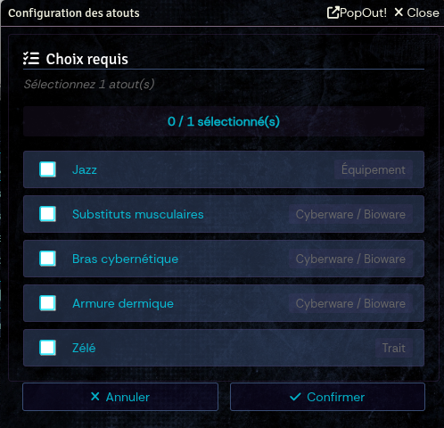

# Welcome to Shadowrun Anarchy 2 Unofficial System

If you are here, you probably know the world has changed, with technology melting with flesh, mythological creatures and magic raising back from the past.

This system implements Shadowrun Anarchy 2 rules for Foundry VTT.

To run a game, you will need the **Shadowrun Anarchy 2 rule book**.

- [Catalyst game labs](https://www.catalystgamelabs.com/) -  [Catalyst game labs products](https://store.catalystgamelabs.com/products/) 
- [Black Book Edition](https://www.black-book-editions.fr/) - [Black Book Edition products](https://black-book-editions.fr/catalogue.php?id=150)

## Compendiums

**Important Note:** This is an unofficial fan project and is not officially supported by Catalyst Game Labs or Black Book Editions.

The system is designed to allow you to create everything found in the Shadowrun Anarchy 2 rulebook and more. However, due to copyright restrictions, we cannot provide pre-made compendiums bundled with the system. Users must create their own content based on the official rulebooks they own.

No compendiums are provided to not infringe CGL or BBE copyrights. This may change depending on decision by BBE/CGL. If you have any contact with them, please let us know; we already have compendiums ready to launch.

# Screenshots

## Character Sheet and dice roll

## Advanced Mode

## Quick NPC Creation

## Simplified NPC View

# System Features

This system provides all the tools needed to play Shadowrun Anarchy 2 in Foundry VTT.

## Actor Types

### Characters (PC/NPC)
- **One sheet for both NPCs and PCs**
- Complete view with all sections: Identity, Attributes, Resources, Combat, Skills, Feats, Weapons, Awakened, Traits
- NPCs can use threshold-based mechanics for quick resolution
- **Advanced Mode**: Toggle detailed view showing all metrics, calculations, and in-depth information for power users

### Group Anarchy
- **Shared Anarchy Points pool** for the entire group
- Automatic synchronization across all player characters
- Group-wide resource management

### Vehicles & Drones
- Full vehicle management with attributes (Autopilot, Structure, Armor, Handling, Speed)
- Support for all vehicle types: Microdrones, Minidrones, Small/Medium/Large Drones, Motorcycles, Cars, Trucks, Boats, Helicopters, VTOLs, T-Birds
- Mounted weapons and autopilot rolling
- Link vehicles to characters

### ICE (Intrusion Countermeasures Electronics)
- Matrix combat support with ICE types: Patrol, Acid, Blaster, Blocker, Black, Glue, Tracker, Killer
- Automated attack and effect application

## Item Types

### Skills
- 15+ base skills with linked attributes (Strength, Agility, Willpower, Logic, Charisma)
- Dice pool calculation (Attribute + Skill + Specialization)
- Drain and Convergence tracking for magical/matrix skills

### Specializations
- Link specializations to parent skills
- Automatic dice pool bonus (+1 die when applicable)

### Feats
All character abilities, equipment, and powers are managed as Feats:

| Type | Description |
|------|-------------|
| **Traits** | Character personality traits and backgrounds |
| **Contacts** | NPC relationships and connections |
| **Awakened** | Magical abilities (Astral Perception, Astral Projection, Sorcery, Conjuration, Adept powers) |
| **Adept Powers** | Physical adept abilities |
| **Equipment** | General gear and items |
| **Armor** | Protective equipment (stacking armor values 0-5) |
| **Cyberware/Bioware** | Cybernetic and biological enhancements (with Essence cost) |
| **Cyberdecks** | Matrix equipment with Firewall and Attack ratings |
| **Vehicles/Drones** | Transportation and remote units |
| **Weapons & Spells** | Combat equipment and magical abilities (40+ weapon types with DV, ranges, linked skills; spell categories: Combat, Detection, Health, Illusion, Manipulation) |
| **Powers** | Special abilities and powers |
| **Knowledge** | Knowledge-based abilities |

### Metatypes
- Human, Elf, Dwarf, Ork, Troll
- Maximum attribute limits
- Anarchy bonus configuration

## Combat System

### Attack & Defense
- **Automated dice rolling** with hit calculation (5-6 = hit)
- **Roll modes**: Normal, Advantage (4-5-6), Disadvantage (6 only)
- **Risk dice**: 5-6 = 2 hits, 1 = critical failure
- **Risk Reduction (RR)**: Reduces critical failures (max 3)
- **Defense rolls**: Select defense skill and roll against attack hits
- **Counter-attacks**: Automatic counter-attack option when defense succeeds
- **Range management**: Automatic application of range bonuses/maluses based on weapon ranges (Melee, Short, Medium, Long) and target distance

### Damage System
Four damage gauges for each character:
- **Physical**: Light wounds (2 boxes), Severe wounds (1 box), Incapacitating
- **Mental/Magic**: Same structure for magical damage
- **Matrix**: Cyberdeck and matrix damage

Damage thresholds calculated from:
- Armor level (0-5)
- Bonuses from feats and equipment

### Weapons
- **40+ weapon types** with pre-configured stats (DV, ranges, linked skills)
- **Range modifiers**: Melee, Short, Medium, Long (OK, Disadvantage, None)
- **Damage Value (DV)**: Fixed or attribute-based (FOR+1, FOR+2, etc.)
- **Automatic skill/specialization linking** for attack and defense

## Magic System

### Awakened Abilities
- Astral Perception and Projection
- Sorcery (spellcasting)
- Conjuration (spirit summoning)
- Adept powers

### Spells
- **Types**: Direct (mana) and Indirect (elemental)
- **Categories**: Combat, Detection, Health, Illusion, Manipulation, Counterspell
- **Sustained spells tracking**
- **Summoned spirits tracking**

### Drain
- Automatic drain complication handling:
  - Minor: Disadvantage to magical activities
  - Critical: Light wound
  - Disaster: Incapacitating wound

## Matrix System

### Cyberdecks
- Firewall and Attack ratings
- Matrix damage tracking
- Light damage bonus configuration

### Matrix Combat
- ICE encounters with automated attacks
- Connection locks
- Firewall/Attack reduction effects
- Location tracking
- Matrix and Biofeedback damage

## Additional Features

### Resources Management
- **Yens (¥)**: Currency tracking
- **Anarchy Points**: Anarchy pool and temp anarchy
- **Essence**: Cyberware/Bioware cost tracking
- **Narrations**: Action economy tracking

### Character Customization
- **Keywords**: Character tags
- **Behaviors**: Personality traits
- **Catchphrases**: Send directly to chat

### GM Tools
- **Fast Roll Tool**: Quick dice rolling for GMs to handle NPCs on the fly without opening character sheets
- **Quick NPC Creation**: Drag & drop NPCs from compendiums with automatic feature selection dialog to quickly build NPCs with desired traits, skills, and equipment

### Quality of Life
- **Quick Actions/Bookmarks**: Favorite skills and weapons for fast rolling
- **Resizable sheets**: Adjust window size to preference
- **Search functionality**: Find items in compendiums and world
- **Drag & drop**: Easy item management
- **Auto-calculation**: Recommended feat levels, total costs, dice pools

### Risk Reduction (RR)
Feats can provide RR bonuses to:
- Attributes
- Skills
- Specializations

### Narrative Effects
- Positive and negative effects on feats
- Value-based modifiers (+1 to +5 or -1 to -5)

# Legal mentions

## License

The system is developed under [Creative Commons BY-SA]("http://creativecommons.org/licenses/by/4.0/), more details in [LICENSE.md](LICENSE.md).

 This work is licensed under a <a rel="license" href="http://creativecommons.org/licenses/by/4.0/">Creative Commons Attribution 4.0 International License</a>.

## Trademarks

Shadowrun Anarchy is © 2016 The Topps Company, Inc.

Shadowrun and Matrix are registered trademarks and/or trademarks of The Topps Company, Inc., in the United States and/or other countries.

Catalyst Game Labs and the Catalyst Game Labs logo are trademarks of InMediaRes Productions, LLC. Printed in the USA.

This FoundryVTT system is a fan project, **not developped by** The Topps Company Inc., Catalyst Games Lab or Black Book Editions.

Ce système FoundryVTT est un projet de fans, **qui n’est pas publié(e)** par Black Book Editions / Topps Company Inc. / Catalyst Game Lab.

## Credits & attributions

Icons are derived from original icons provided under [Creative Commons 3.0 BY license](http://creativecommons.org/licenses/by/3.0/), on [game-icons.net](game-icons.net):
- by Dirt
- by Lorc
- by Delapouite
- by Skoll

# The Anarchy development team

- **Half** - Discord: half3405 - Email: cyril@dbyzero.com
- **Vincent VK** - Discord: vincentvk - Email: vincent.vandeme@gmail.com
- **Los Brutos** - Discord: losbrutos
- **Cefyl** - Discord: cefyl
- **Dirt** - Discord: dirtndust
- **Romano** - Discord: roms3559
- **Carmody** - Discord: carmody.
- **Asimov** - Discord: asimov_
